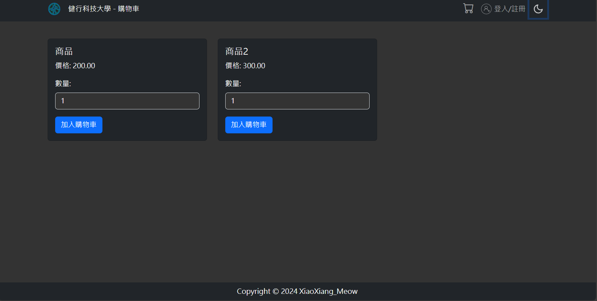
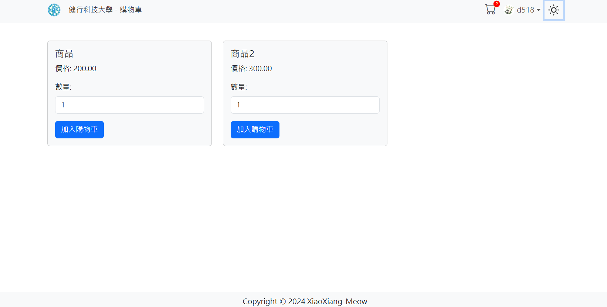
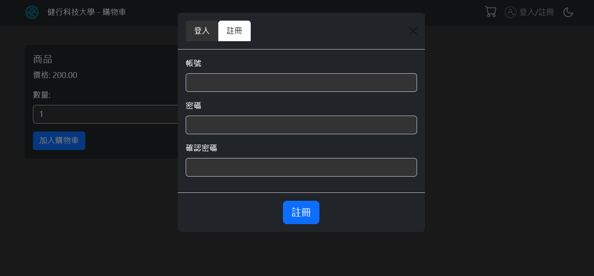
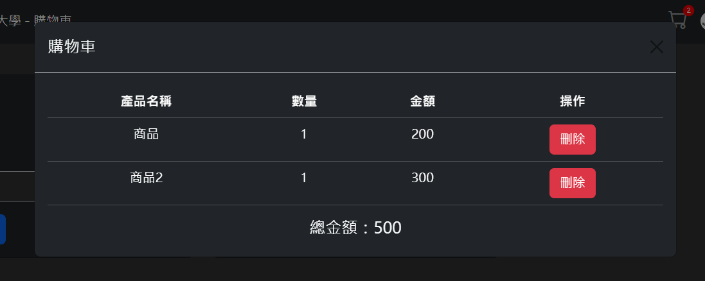
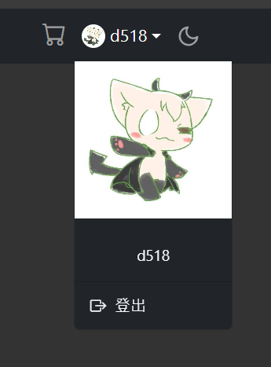

# 資料庫程式設計期末專題 - 購物車

這是一個為資料庫程式設計課程期末專題所製作的簡單的購物網站。

## 功能特色

1. **使用者認證**：使用者可以進行登入和註冊。
    - 登入：透過 `auth/loginHandler.php` 進行處理。
    - 註冊：透過 `auth/registerHandler.php` 進行處理。

2. **購物車管理**：使用者可以管理他們的購物車。
    - 加入購物車：透過 `includes/cart_func/add_to_cart.php` 進行處理。
    - 查看購物車：透過 `includes/cart_func/get_cart.php` 進行處理。
    - 查看購物車數量：透過 `includes/cart_func/get_cart_quantity.php` 進行處理。
    - 從購物車移除：透過 `includes/cart_func/remove_from_cart.php` 進行處理。

## 安裝與使用

1. 下載專案的壓縮檔或使用 Git Clone。
2. 在終端機中進入專案資料夾。
3. 修改 `db.php`，將資料庫設定改為您自己的設定。
4. 使用 XAMPP 或 AppServ 啟動 Apache 和 MySQL 並把檔案放入。
5. 建立以下資料表：

```sql
CREATE TABLE users (
    id INT AUTO_INCREMENT PRIMARY KEY,
    username VARCHAR(50) NOT NULL,
    password VARCHAR(255) NOT NULL
);

CREATE TABLE products (
    id INT AUTO_INCREMENT PRIMARY KEY,
    name VARCHAR(100) NOT NULL,
    description TEXT,
    price DECIMAL(10, 2) NOT NULL
);

CREATE TABLE carts (
    id INT AUTO_INCREMENT PRIMARY KEY,
    user_id INT,
    FOREIGN KEY (user_id) REFERENCES users(id)
);

CREATE TABLE cart_items (
    id INT AUTO_INCREMENT PRIMARY KEY,
    cart_id INT,
    product_id INT,
    quantity INT NOT NULL,
    FOREIGN KEY (cart_id) REFERENCES carts(id),
    FOREIGN KEY (product_id) REFERENCES products(id)
);
```

6. 確認所有設定都已完成後，即可開始使用此專案。

## 技術堆疊

- PHP：用於處理後端邏輯，如使用者認證和購物車管理。
- JavaScript：用於處理前端邏輯，如表單驗證和動態渲染。
- CSS：用於頁面的樣式設計。
- Bootstrap 5：用於快速設計和自定義響應式網站。

## 網站預覽 (Website Preview)

- **購物車主頁面 (暗色主題)**
  
- **白色頁面 (亮色主題)**
  
- **登入模態框**
  
- **購物車模態框**
  
- **用戶資訊框**<br>
  
